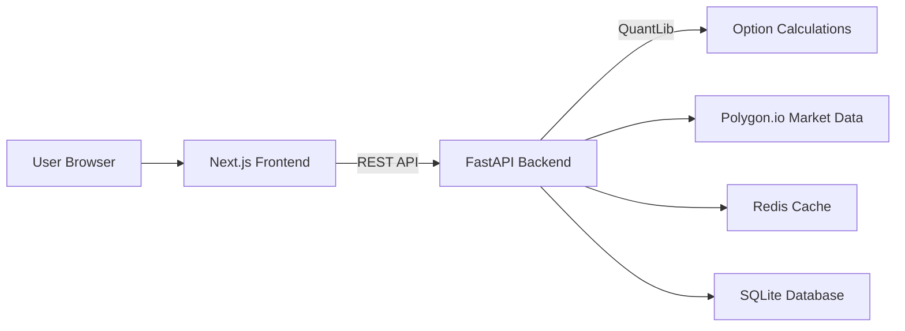

Technical implementation plan for the Options Scenario Analysis and Exploration App. It is written to guide **junior developers** to build a sophisticated, flexible system while maintaining clarity for senior reviewers. 

---

# **Options Scenario Analysis & Exploration App**  
### *Comprehensive Technical Implementation Plan*

---

## **1. Overview**

This web-based application aims to enable **advanced option position scenario analysis** through both a **spreadsheet-like interface** and **interactive visualizations**. The system supports multi-asset option portfolios, real-time Greek calculations, parameter shifts (underlying price, volatility, time, interest rates), and advanced risk metrics.

### **Key Features**
- **Spreadsheet View** for intuitive position entry (e.g., ticker, expiration, strike, option type) and **real-time Greeks** calculations.
- **Visual Analysis** for scenario exploration (price, implied volatility, time shifts) and interactive 3D surfaces.
- **Modular Architecture** designed for extensibility (e.g., advanced risk metrics, multi-asset correlation analyses, value-at-risk calculations).

---

## **2. System Architecture**

This plan adopts a **simplified architecture** with logical separation between frontend and backend, optimized for a small user base (≤5 concurrent users) while maintaining fast calculation capabilities.

| **Layer**         | **Technology**               | **Responsibility**                                                 |
|-------------------|------------------------------|---------------------------------------------------------------------|
| **Frontend**      | **Next.js 15**, **Plotly.js**| Client-side UI, data visualization (3D surfaces, advanced charts).  |
| **Backend**       | **FastAPI 0.109**, **QuantLib 1.32** | Option pricing, Greeks calculation, scenario modeling, data orchestration. |
| **Data Ingestion**| **Polygon.io** | Real-time market data ingestion. |
| **Infrastructure**| **Docker Compose**, **Redis**, **SQLite** (for user/portfolio data) | Simple orchestration, caching, lightweight data storage. |

### **High-Level Diagram**



---

## **3. Project Structure & Tooling**

A simple project structure with clear separation between frontend and backend components.

```
OPTIONSTRAT/
├── src
  ├── frontend/              # Next.js application
  │   ├── app/              # Next.js 15 App Router
  │   │   ├── page.tsx      # Home page
  │   │   ├── positions/    # Position management pages
  │   │   └── visualizations/ # Charts and analysis pages
  │   ├── components/       # Reusable UI components
  │   │   ├── PositionTable.tsx  # Spreadsheet interface
  │   │   ├── GreeksDisplay.tsx  # Greeks visualization
  │   │   └── charts/       # Visualization components
  │   ├── lib/              # Frontend utilities
  │   │   ├── hooks/        # Custom React hooks
  │   │   ├── stores/       # State management (Zustand)
  │   │   └── api.ts        # API client functions
  │   └── public/           # Static assets
  ├── backend/              # FastAPI application
  │   ├── app/
  │   │   ├── main.py       # FastAPI initialization
  │   │   ├── models/       # Pydantic data models
  │   │   ├── routes/       # API endpoints
  │   │   │   ├── positions.py  # Position CRUD operations
  │   │   │   ├── greeks.py     # Greeks calculations
  │   │   │   └── scenarios.py  # Scenario analysis
  │   │   ├── services/     # Business logic
  │   │   │   ├── option_pricing.py  # QuantLib wrapper
  │   │   │   ├── market_data.py     # Data fetching
  │   │   │   └── scenario_engine.py # Simulation logic
  │   │   └── utils/        # Helper functions
  │   └── tests/            # Backend tests
├── docker-compose.yml    # Service orchestration
└── README.md             # Project documentation
```

### **Tool Versions**
- **Node.js**: v18+
- **Python**: 3.11+
- **Next.js**: 15.1.7
- **FastAPI**: 0.109+
- **QuantLib**: 1.32

---

## **4. Implementation Phases**

Below is a phased approach with more detailed steps for junior developers. Each phase includes **technical milestones**, **deliverables**, and **success metrics**.

### **Phase 1: Development Environment Setup (✅ COMPLETED)**

| **Milestone**                | **Deliverables**                                                 | **Success Metrics**                          |
|------------------------------|------------------------------------------------------------------|----------------------------------------------|
| **Repo Setup**               | - Git repo, folder structure                                      | - All developers can clone and run the project |
| **Dev Environment**          | - VSCode settings, extensions, linting config                     | - Consistent dev experience                   |
| **Docker Setup**             | - Docker Compose file with services                              | - `docker-compose up` runs all components    |

### **Phase 2: Frontend Core Development (✅ COMPLETED)**

| **Milestone**                | **Deliverables**                                                 | **Success Metrics**                          |
|------------------------------|------------------------------------------------------------------|----------------------------------------------|
| **UI Framework**             | - Next.js 15 with Tailwind CSS 4                                | - Consistent UI elements across the app      |
| **App Navigation**           | - Header, sidebar, main content areas                           | - All app sections are accessible           |
| **Position Management**      | - Form for adding positions, table for viewing                  | - Users can add, edit, and delete positions |
| **Visualization Placeholders** | - Chart components with mock data                             | - UI ready for real data integration        |

### **Phase 3: Backend Core Development (🚧 IN PROGRESS)**

#### **Phase 3.1: FastAPI Routes & Models (Current Focus)**

| **Milestone**                | **Deliverables**                                                 | **Success Metrics**                          |
|------------------------------|------------------------------------------------------------------|----------------------------------------------|
| **Data Models**              | - Pydantic models for positions and calculations                | - Models validate all expected input         |
| **API Routes**               | - CRUD endpoints for positions                                   | - All endpoints return correct status codes |
| **Database Setup**           | - SQLite connection with SQLAlchemy                             | - Data persists between server restarts     |

#### **Instructions for Junior Devs**

1. **Create Database Models**
   ```python
   # backend/app/models/database.py
   from sqlalchemy import Column, Integer, String, Float, DateTime, create_engine
   from sqlalchemy.ext.declarative import declarative_base
   from sqlalchemy.orm import sessionmaker
   import datetime
   
   SQLALCHEMY_DATABASE_URL = "sqlite:///./options.db"
   
   engine = create_engine(SQLALCHEMY_DATABASE_URL, connect_args={"check_same_thread": False})
   SessionLocal = sessionmaker(autocommit=False, autoflush=False, bind=engine)
   Base = declarative_base()
   
   
   class DBPosition(Base):
       __tablename__ = "positions"
   
       id = Column(String, primary_key=True, index=True)
       ticker = Column(String, index=True)
       expiration = Column(DateTime)
       strike = Column(Float)
       option_type = Column(String)  # "call" or "put"
       action = Column(String)  # "buy" or "sell"
       quantity = Column(Integer)
       premium = Column(Float, nullable=True)
       created_at = Column(DateTime, default=datetime.datetime.utcnow)
       updated_at = Column(DateTime, default=datetime.datetime.utcnow, onupdate=datetime.datetime.utcnow)
   
   
   # Create tables
   Base.metadata.create_all(bind=engine)
   
   
   # Dependency to get DB session
   def get_db():
       db = SessionLocal()
       try:
           yield db
       finally:
           db.close()
   ```

2. **Create Pydantic Models**
   ```python
   # backend/app/models/schemas.py
   from pydantic import BaseModel, Field
   from datetime import datetime
   from typing import Optional, Literal
   
   
   class GreeksBase(BaseModel):
       delta: float
       gamma: float
       theta: float
       vega: float
       rho: float
   
   
   class PositionBase(BaseModel):
       ticker: str
       expiration: datetime
       strike: float = Field(..., gt=0)
       option_type: Literal["call", "put"]
       action: Literal["buy", "sell"]
       quantity: int = Field(..., gt=0)
       premium: Optional[float] = None
   
   
   class PositionCreate(PositionBase):
       pass
   
   
   class PositionUpdate(BaseModel):
       ticker: Optional[str] = None
       expiration: Optional[datetime] = None
       strike: Optional[float] = Field(None, gt=0)
       option_type: Optional[Literal["call", "put"]] = None
       action: Optional[Literal["buy", "sell"]] = None
       quantity: Optional[int] = Field(None, gt=0)
       premium: Optional[float] = None
   
   
   class Position(PositionBase):
       id: str
       created_at: datetime
       updated_at: datetime
       greeks: Optional[GreeksBase] = None
   
       class Config:
           orm_mode = True
   
   
   class GreeksCalculationRequest(BaseModel):
       ticker: str
       expiration: datetime
       strike: float
       option_type: Literal["call", "put"]
       spot_price: Optional[float] = None
       volatility: Optional[float] = None
       risk_free_rate: Optional[float] = 0.05
   ```

#### **Phase 3.2: Option Pricing & Greeks Calculation with QuantLib (Current Priority)**

| **Milestone**                | **Deliverables**                                                 | **Success Metrics**                          |
|------------------------------|------------------------------------------------------------------|----------------------------------------------|
| **QuantLib Integration**     | - Wrapper class for option pricing                              | - Accurate pricing for basic options        |
| **Greeks Calculation API**   | - Endpoints for calculating Greeks                              | - Greeks match expected values within 1%    |
| **Market Data Service**      | - Integration with Polygon.io                                   | - Real-time market data available           |

#### **Instructions for Junior Devs**

1. **Create Option Pricing Service with QuantLib**
   ```python
   # backend/app/services/option_pricing.py
   import QuantLib as ql
   from datetime import datetime
   from typing import Dict, Literal, Optional
   
   
   class OptionPricer:
       def __init__(self):
           self.day_count = ql.Actual365Fixed()
           self.calendar = ql.UnitedStates()
   
       def calculate_price_and_greeks(
           self,
           spot_price: float,
           strike: float,
           vol: float,
           expiry: datetime,
           option_type: Literal["call", "put"],
           risk_free_rate: float = 0.05,
           is_american: bool = True
       ) -> Dict[str, float]:
           """Calculate option price and greeks using QuantLib"""
           
           # Current date setup
           calculation_date = ql.Date.todaysDate()
           ql.Settings.instance().evaluationDate = calculation_date
           
           # Convert expiration to QuantLib date
           expiry_year = expiry.year
           expiry_month = expiry.month
           expiry_day = expiry.day
           expiry_date = ql.Date(expiry_day, expiry_month, expiry_year)
           
           # Check if expiration is valid
           if expiry_date <= calculation_date:
               raise ValueError("Expiration date must be in the future")
           
           # Calculate time to expiration in years
           time_to_expiry = self.day_count.yearFraction(calculation_date, expiry_date)
           
           # Set up the option
           option_type_ql = ql.Option.Call if option_type == "call" else ql.Option.Put
           payoff = ql.PlainVanillaPayoff(option_type_ql, strike)
           
           # Choose exercise type (American or European)
           if is_american:
               exercise = ql.AmericanExercise(calculation_date, expiry_date)
           else:
               exercise = ql.EuropeanExercise(expiry_date)
               
           option = ql.VanillaOption(payoff, exercise)
           
           # Set up the model
           spot_handle = ql.QuoteHandle(ql.SimpleQuote(spot_price))
           rate_ts = ql.YieldTermStructureHandle(
               ql.FlatForward(calculation_date, risk_free_rate, self.day_count)
           )
           vol_ts = ql.BlackVolTermStructureHandle(
               ql.BlackConstantVol(calculation_date, self.calendar, vol, self.day_count)
           )
           
           # Create Black-Scholes-Merton process
           bsm_process = ql.BlackScholesMertonProcess(spot_handle, rate_ts, rate_ts, vol_ts)
           
           # Set up the pricing engine based on exercise type
           if is_american:
               # For American options, use Binomial model
               engine = ql.BinomialVanillaEngine(bsm_process, "crr", 200)
           else:
               # For European options, use analytic Black-Scholes formula
               engine = ql.AnalyticEuropeanEngine(bsm_process)
               
           option.setPricingEngine(engine)
           
           # Calculate price and greeks
           price = option.NPV()
           delta = option.delta()
           gamma = option.gamma()
           theta = option.theta() / 365.0  # Convert from daily to yearly
           vega = option.vega() / 100.0    # Convert from 1% to 0.01
           rho = option.rho() / 100.0      # Convert from 1% to 0.01
           
           return {
               "price": price,
               "greeks": {
                   "delta": delta,
                   "gamma": gamma,
                   "theta": theta,
                   "vega": vega,
                   "rho": rho
               }
           }
           
       def calculate_implied_volatility(
           self,
           option_price: float,
           spot_price: float,
           strike: float,
           expiry: datetime,
           option_type: Literal["call", "put"],
           risk_free_rate: float = 0.05,
           is_american: bool = True
       ) -> float:
           """Calculate implied volatility from option price"""
           
           # Current date setup
           calculation_date = ql.Date.todaysDate()
           ql.Settings.instance().evaluationDate = calculation_date
           
           # Convert expiration to QuantLib date
           expiry_date = ql.Date(expiry.day, expiry.month, expiry.year)
           
           # Set up the option
           option_type_ql = ql.Option.Call if option_type == "call" else ql.Option.Put
           payoff = ql.PlainVanillaPayoff(option_type_ql, strike)
           
           # Choose exercise type
           if is_american:
               exercise = ql.AmericanExercise(calculation_date, expiry_date)
           else:
               exercise = ql.EuropeanExercise(expiry_date)
               
           option = ql.VanillaOption(payoff, exercise)
           
           # Set up the model
           spot_handle = ql.QuoteHandle(ql.SimpleQuote(spot_price))
           rate_ts = ql.YieldTermStructureHandle(
               ql.FlatForward(calculation_date, risk_free_rate, self.day_count)
           )
           
           # Initial volatility guess
           vol_guess = 0.3  # 30%
           
           try:
               # For American options
               if is_american:
                   # Use binomial tree for American options
                   process = ql.BlackScholesMertonProcess(
                       spot_handle, 
                       rate_ts, 
                       rate_ts,
                       ql.BlackVolTermStructureHandle(
                           ql.BlackConstantVol(calculation_date, self.calendar, vol_guess, self.day_count)
                       )
                   )
                   
                   engine = ql.BinomialVanillaEngine(process, "crr", 200)
                   option.setPricingEngine(engine)
                   
                   # Use numerical solver to find implied volatility
                   implied_vol = option.impliedVolatility(
                       option_price, 
                       process,
                       1.0e-6,  # accuracy
                       100,     # max evaluations
                       0.001,   # min vol
                       4.0      # max vol
                   )
               else:
                   # For European options, we can use the analytic formula
                   implied_vol = option.impliedVolatility(
                       option_price, 
                       ql.BlackScholesMertonProcess(
                           spot_handle, 
                           rate_ts, 
                           rate_ts,
                           ql.BlackVolTermStructureHandle(
                               ql.BlackConstantVol(calculation_date, self.calendar, vol_guess, self.day_count)
                           )
                       ),
                       1.0e-6,  # accuracy
                       100,     # max evaluations
                       0.001,   # min vol
                       4.0      # max vol
                   )
                   
               return implied_vol
           except RuntimeError:
               # If implied volatility calculation fails
               raise ValueError("Could not calculate implied volatility. Check if the option price is reasonable.")
   ```

2. **Create Greeks Calculation Endpoint**
   ```python
   # backend/app/routes/greeks.py
   from fastapi import APIRouter, Depends, HTTPException
   from ..models.schemas import GreeksCalculationRequest, GreeksBase
   from ..services.option_pricing import OptionPricer
   from ..services.market_data import MarketDataService
   
   router = APIRouter(
       prefix="/greeks",
       tags=["greeks"],
   )
   
   
   @router.post("/calculate", response_model=GreeksBase)
   async def calculate_greeks(request: GreeksCalculationRequest):
       # Create services
       pricer = OptionPricer()
       market_data = MarketDataService()
       
       # Get market data if not provided
       spot_price = request.spot_price
       if spot_price is None:
           spot_price = market_data.get_ticker_price(request.ticker)
           if spot_price is None:
               raise HTTPException(
                   status_code=400,
                   detail=f"Could not retrieve spot price for {request.ticker}"
               )
       
       volatility = request.volatility
       if volatility is None:
           volatility = market_data.get_ticker_volatility(request.ticker)
           if volatility is None:
               raise HTTPException(
                   status_code=400,
                   detail=f"Could not retrieve volatility for {request.ticker}"
               )
       
       # Calculate option price and greeks
       try:
           result = pricer.calculate_price_and_greeks(
               spot_price=spot_price,
               strike=request.strike,
               vol=volatility,
               expiry=request.expiration,
               option_type=request.option_type,
               risk_free_rate=request.risk_free_rate
           )
           
           # Return the greeks
           return result["greeks"]
       except Exception as e:
           raise HTTPException(
               status_code=400,
               detail=f"Error calculating greeks: {str(e)}"
           )
   
   
   @router.post("/implied-volatility")
   async def calculate_implied_volatility(
       ticker: str,
       option_price: float,
       strike: float,
       expiration: str,  # ISO format date string
       option_type: str,  # "call" or "put"
       spot_price: float = None,
       risk_free_rate: float = 0.05
   ):
       # Create services
       pricer = OptionPricer()
       market_data = MarketDataService()
       
       # Get market data if not provided
       if spot_price is None:
           spot_price = market_data.get_ticker_price(ticker)
           if spot_price is None:
               raise HTTPException(
                   status_code=400,
                   detail=f"Could not retrieve spot price for {ticker}"
               )
       
       # Parse expiration date
       try:
           expiry = datetime.fromisoformat(expiration)
       except ValueError:
           raise HTTPException(
               status_code=400,
               detail="Invalid expiration date format. Use ISO format (YYYY-MM-DD)."
           )
       
       # Validate option type
       if option_type not in ["call", "put"]:
           raise HTTPException(
               status_code=400,
               detail="Option type must be 'call' or 'put'."
           )
       
       # Calculate implied volatility
       try:
           implied_vol = pricer.calculate_implied_volatility(
               option_price=option_price,
               spot_price=spot_price,
               strike=strike,
               expiry=expiry,
               option_type=option_type,
               risk_free_rate=risk_free_rate
           )
           
           return {"implied_volatility": implied_vol}
       except ValueError as e:
           raise HTTPException(
               status_code=400,
               detail=str(e)
           )
   ```

### **Phase 4: Visualization & Integration (Upcoming)**

#### **Phase 4.1: Frontend-Backend Integration**

| **Milestone**                | **Deliverables**                                                 | **Success Metrics**                          |
|------------------------------|------------------------------------------------------------------|----------------------------------------------|
| **API Client**               | - Frontend service to call backend APIs                         | - All API calls work with proper error handling |
| **Position CRUD**            | - Connect frontend position table to backend                    | - Data persists between page refreshes      |
| **Real-time Greeks**         | - Display calculated Greeks in the UI                          | - Greeks update when positions change       |

#### **Phase 4.2: Scenario Visualization**

| **Milestone**                | **Deliverables**                                                 | **Success Metrics**                          |
|------------------------------|------------------------------------------------------------------|----------------------------------------------|
| **Plotly Integration**       | - Custom hooks for chart data                                   | - Charts render without errors               |
| **P&L Surface**              | - 3D visualization of P&L vs. price & volatility               | - Interactive surface with hover data        |
| **Scenario Controls**        | - UI to adjust scenario parameters                             | - Chart updates when parameters change       |

### **Phase 5: Deployment & Documentation (Final Phase)**

| **Milestone**                | **Deliverables**                                                 | **Success Metrics**                          |
|------------------------------|------------------------------------------------------------------|----------------------------------------------|
| **Docker Compose**           | - Complete docker-compose.yml                                   | - One-command startup                       |
| **Environment Config**       | - .env files for dev and prod                                   | - Easy configuration between environments    |
| **README**                   | - Complete setup documentation                                  | - New dev can set up in under an hour        |

---

## **5. Simplified Testing & Maintenance**

This section is slimmed down to focus on the essentials for a small team with limited users:

### **Basic Testing**

| **Test Type**        | **Tools**                           | **Coverage**                                      |
|----------------------|-------------------------------------|---------------------------------------------------|
| **Backend Unit Tests** | pytest                            | Core calculations, API endpoints                   |
| **Frontend Tests**    | Jest, React Testing Library        | Key components, data fetching                      |
| **Manual Testing**    | Browser developer tools            | UI flows, visual consistency                       |

### **Maintenance Essentials**

1. **Version Control**
   - Use descriptive branch names and commit messages.
   - Create pull requests for code review before merging.

2. **Dependency Management**
   - Regularly update dependencies to benefit from security patches.
   - Use `npm outdated` and `pip list --outdated` to check for updates.

3. **Backup Strategy**
   - Regularly backup the SQLite database file (can be automated with a cron job).
   - Consider using version control for configuration files (with sensitive data properly excluded).

---

## **Conclusion**

This implementation plan provides junior developers with a clear path to building a functional options analysis tool. With the frontend now complete and packages upgraded to the latest versions, the focus shifts to backend development with QuantLib integration for accurate options pricing and Greeks calculations. The modular structure allows for future enhancements while maintaining a clean separation of concerns.

