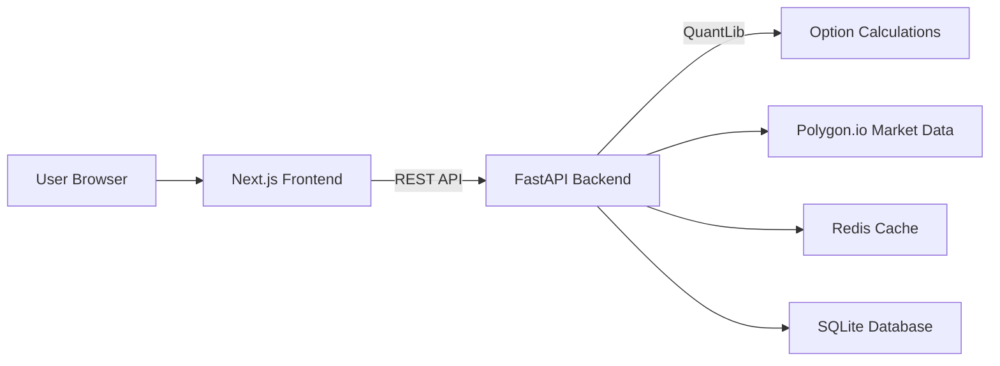

Technical implementation plan for the Options Scenario Analysis and Exploration App. It is written to guide **junior developers** to build a sophisticated, flexible system while maintaining clarity for senior reviewers. 

---

# **Options Scenario Analysis & Exploration App**  
### *Comprehensive Technical Implementation Plan*

---

## **1. Overview**

This web-based application aims to enable **advanced option position scenario analysis** through both a **spreadsheet-like interface** and **interactive visualizations**. The system supports multi-asset option portfolios, real-time Greek calculations, parameter shifts (underlying price, volatility, time, interest rates), and advanced risk metrics.

### **Key Features**
- **Spreadsheet View** for intuitive position entry (e.g., ticker, expiration, strike, option type) and **real-time Greeks** calculations.
- **Visual Analysis** for scenario exploration (price, implied volatility, time shifts) and interactive 3D surfaces.
- **Modular Architecture** designed for extensibility (e.g., advanced risk metrics, multi-asset correlation analyses, value-at-risk calculations).

---

## **2. System Architecture**

This plan adopts a **simplified architecture** with logical separation between frontend and backend, optimized for a small user base (≤5 concurrent users) while maintaining fast calculation capabilities.

| **Layer**         | **Technology**               | **Responsibility**                                                 |
|-------------------|------------------------------|---------------------------------------------------------------------|
| **Frontend**      | **Next.js 15**, **Plotly.js**| Client-side UI, data visualization (3D surfaces, advanced charts).  |
| **Backend**       | **FastAPI 0.109**, **QuantLib 1.32** | Option pricing, Greeks calculation, scenario modeling, data orchestration. |
| **Data Ingestion**| **Polygon.io** | Real-time market data ingestion. |
| **Infrastructure**| **Docker Compose**, **Redis**, **SQLite** (for user/portfolio data) | Simple orchestration, caching, lightweight data storage. |

### **High-Level Diagram**



---

## **3. Project Structure & Tooling**

A simple project structure with clear separation between frontend and backend components.

```
option-analysis/
├── frontend/              # Next.js application
│   ├── app/              # Next.js 15 App Router
│   │   ├── page.tsx      # Home page
│   │   ├── positions/    # Position management pages
│   │   └── visualizations/ # Charts and analysis pages
│   ├── components/       # Reusable UI components
│   │   ├── PositionTable.tsx  # Spreadsheet interface
│   │   ├── GreeksDisplay.tsx  # Greeks visualization
│   │   └── charts/       # Visualization components
│   ├── lib/              # Frontend utilities
│   │   ├── hooks/        # Custom React hooks
│   │   ├── stores/       # State management (Zustand)
│   │   └── api.ts        # API client functions
│   └── public/           # Static assets
├── backend/              # FastAPI application
│   ├── app/
│   │   ├── main.py       # FastAPI initialization
│   │   ├── models/       # Pydantic data models
│   │   ├── routes/       # API endpoints
│   │   │   ├── positions.py  # Position CRUD operations
│   │   │   ├── greeks.py     # Greeks calculations
│   │   │   └── scenarios.py  # Scenario analysis
│   │   ├── services/     # Business logic
│   │   │   ├── option_pricing.py  # QuantLib wrapper
│   │   │   ├── market_data.py     # Data fetching
│   │   │   └── scenario_engine.py # Simulation logic
│   │   └── utils/        # Helper functions
│   └── tests/            # Backend tests
├── docker-compose.yml    # Service orchestration
└── README.md             # Project documentation
```

### **Tool Versions**
- **Node.js**: v18+
- **Python**: 3.11+
- **Next.js**: 15
- **FastAPI**: 0.109+
- **QuantLib**: 1.32

---

## **4. Implementation Phases**

Below is a phased approach with more detailed steps for junior developers. Each phase includes **technical milestones**, **deliverables**, and **success metrics**.

### **Phase 1: Development Environment Setup (Week 1)**

| **Milestone**                | **Deliverables**                                                 | **Success Metrics**                          |
|------------------------------|------------------------------------------------------------------|----------------------------------------------|
| **Repo Setup**               | - Git repo, folder structure                                      | - All developers can clone and run the project |
| **Dev Environment**          | - VSCode settings, extensions, linting config                     | - Consistent dev experience                   |
| **Docker Setup**             | - Docker Compose file with services                              | - `docker-compose up` runs all components    |

#### **Instructions for Junior Devs**

1. **Repository Setup**
   ```bash
   # Clone the repository
   git clone https://github.com/your-org/option-analysis.git
   cd option-analysis
   
   # Create project structure
   mkdir -p frontend/app frontend/components frontend/lib frontend/public
   mkdir -p backend/app/models backend/app/routes backend/app/services backend/app/utils
   mkdir -p backend/tests
   
   # Initialize git
   git init
   echo "node_modules/\n.next/\n__pycache__/\n*.pyc\n.env\n.venv/" > .gitignore
   git add .
   git commit -m "Initial project structure"
   ```

2. **Frontend Setup**
   ```bash
   # Navigate to frontend directory
   cd frontend
   
   # Initialize Next.js project
   npm init -y
   npm install next@15 react react-dom
   npm install plotly.js zustand @tanstack/react-table
   npm install -D typescript @types/react @types/node eslint
   
   # Add scripts to package.json
   # "dev": "next dev",
   # "build": "next build",
   # "start": "next start"
   
   # Create simple tsconfig.json
   npx tsc --init
   
   # Create first page
   echo 'export default function Home() { return <h1>Options Analysis Tool</h1>; }' > app/page.tsx
   ```

3. **Backend Setup**
   ```bash
   # Navigate to backend directory
   cd ../backend
   
   # Create virtual environment
   python -m venv venv
   source venv/bin/activate  # On Windows: venv\Scripts\activate
   
   # Install dependencies
   pip install fastapi uvicorn sqlalchemy pydantic python-dotenv requests redis
   pip install pytest pytest-asyncio httpx
   
   # Create requirements.txt
   pip freeze > requirements.txt
   
   # Create main.py
   echo "from fastapi import FastAPI
   
   app = FastAPI(title=\"Options Analysis API\")
   
   @app.get(\"/health\")
   async def health_check():
       return {\"status\": \"healthy\"}
   " > app/main.py
   ```

4. **Docker Compose Setup**
   ```bash
   # Create docker-compose.yml in the root directory
   echo "version: '3.8'
   services:
     frontend:
       build: ./frontend
       ports:
         - \"3000:3000\"
       environment:
         - NEXT_PUBLIC_API_URL=http://localhost:8000
       volumes:
         - ./frontend:/app
         - /app/node_modules
     
     backend:
       build: ./backend
       ports:
         - \"8000:8000\"
       environment:
         - REDIS_URL=redis://redis:6379
       volumes:
         - ./backend:/app
     
     redis:
       image: redis:7-alpine
       ports:
         - \"6379:6379\"
   " > docker-compose.yml
   
   # Create Dockerfile for frontend
   echo "FROM node:18-alpine
   WORKDIR /app
   COPY package*.json ./
   RUN npm install
   COPY . .
   CMD [\"npm\", \"run\", \"dev\"]
   " > frontend/Dockerfile
   
   # Create Dockerfile for backend
   echo "FROM python:3.11-slim
   WORKDIR /app
   COPY requirements.txt .
   RUN pip install --no-cache-dir -r requirements.txt
   COPY . .
   CMD [\"uvicorn\", \"app.main:app\", \"--host\", \"0.0.0.0\", \"--reload\"]
   " > backend/Dockerfile
   ```

### **Phase 2: Frontend Core Development (Weeks 2-3)**

#### **Phase 2.1: UI Framework & Layout (Week 2)**

| **Milestone**                | **Deliverables**                                                 | **Success Metrics**                          |
|------------------------------|------------------------------------------------------------------|----------------------------------------------|
| **UI Component Library**     | - Set up Tailwind CSS or Material UI                             | - Consistent UI elements across the app      |
| **App Navigation**           | - Header, sidebar, main content areas                           | - All app sections are accessible           |
| **Responsive Layout**        | - Desktop and tablet optimization                               | - UI works on various screen sizes          |

#### **Instructions for Junior Devs**

1. **Set up Tailwind CSS**
   ```bash
   cd frontend
   npm install -D tailwindcss postcss autoprefixer
   npx tailwindcss init -p
   ```

2. **Create Layout Component**
   ```typescript
   // frontend/app/layout.tsx
   import './globals.css'
   
   export default function RootLayout({
     children,
   }: {
     children: React.ReactNode
   }) {
     return (
       <html lang="en">
         <body>
           <header className="bg-gray-800 text-white p-4">
             <h1 className="text-xl font-bold">Options Analysis Tool</h1>
           </header>
           <div className="flex min-h-screen">
             <nav className="w-64 bg-gray-100 p-4">
               <ul>
                 <li className="mb-2"><a href="/" className="block p-2 hover:bg-gray-200 rounded">Dashboard</a></li>
                 <li className="mb-2"><a href="/positions" className="block p-2 hover:bg-gray-200 rounded">Positions</a></li>
                 <li className="mb-2"><a href="/visualizations" className="block p-2 hover:bg-gray-200 rounded">Analysis</a></li>
               </ul>
             </nav>
             <main className="flex-1 p-6 bg-white">
               {children}
             </main>
           </div>
         </body>
       </html>
     )
   }
   ```

3. **Create Basic Pages**
   ```typescript
   // frontend/app/positions/page.tsx
   export default function PositionsPage() {
     return (
       <div>
         <h2 className="text-2xl font-bold mb-4">Position Management</h2>
         <p>Your option positions will appear here.</p>
       </div>
     )
   }
   
   // frontend/app/visualizations/page.tsx
   export default function VisualizationsPage() {
     return (
       <div>
         <h2 className="text-2xl font-bold mb-4">Position Analysis</h2>
         <p>Visual analysis tools will appear here.</p>
       </div>
     )
   }
   ```

#### **Phase 2.2: Position Table Component (Week 3)**

| **Milestone**                | **Deliverables**                                                 | **Success Metrics**                          |
|------------------------------|------------------------------------------------------------------|----------------------------------------------|
| **Position Store**           | - Zustand store for position state                              | - CRUD operations work for positions        |
| **Table Component**          | - TanStack Table implementation                                  | - Users can view and sort positions         |
| **Position Form**            | - Form to add/edit positions                                    | - Validation works for all fields           |

#### **Instructions for Junior Devs**

1. **Create Position Store**
   ```typescript
   // frontend/lib/stores/positionStore.ts
   import { create } from 'zustand';
   import { v4 as uuidv4 } from 'uuid';
   
   interface OptionPosition {
     id: string;
     ticker: string;
     expiration: string;
     strike: number;
     type: 'call' | 'put';
     action: 'buy' | 'sell';
     quantity: number;
     premium?: number;
     greeks?: Greeks;
   }
   
   interface PositionStore {
     positions: OptionPosition[];
     addPosition: (position: Omit<OptionPosition, 'id'>) => void;
     updatePosition: (id: string, position: Partial<OptionPosition>) => void;
     removePosition: (id: string) => void;
     calculateGreeks: (position: OptionPosition) => Promise<void>;
   }
   
   export const usePositionStore = create<PositionStore>((set, get) => ({
     positions: [],
     addPosition: (position) => set((state) => ({
       positions: [...state.positions, { ...position, id: uuidv4() }],
     })),
     updatePosition: (id, position) => set((state) => ({
       positions: state.positions.map(pos => pos.id === id ? { ...pos, ...position } : pos),
     })),
     removePosition: (id) => set((state) => ({
       positions: state.positions.filter(pos => pos.id !== id),
     })),
     calculateGreeks: async (position) => {
       try {
         const greeks = await api.greeks.calculate({
           ticker: position.ticker,
           expiration: position.expiration,
           strike: position.strike,
           type: position.type,
         });
         
         set(state => ({
           positions: state.positions.map(pos => 
             pos.id === position.id ? { ...pos, greeks } : pos
           ),
         }));
         
         return greeks;
       } catch (error) {
         console.error('Error calculating greeks:', error);
       }
     },
   }));
   ```

2. **Create Position Table Component**
   ```typescript
   // frontend/components/PositionTable.tsx
   import { usePositionStore, OptionPosition } from '../lib/stores/positionStore';
   import { 
     createColumnHelper,
     flexRender,
     getCoreRowModel,
     useReactTable,
   } from '@tanstack/react-table';
   
   export default function PositionTable() {
     const { positions, removePosition } = usePositionStore();
     
     const columnHelper = createColumnHelper<OptionPosition>();
     
     const columns = [
       columnHelper.accessor('ticker', {
         header: 'Ticker',
         cell: info => info.getValue(),
       }),
       columnHelper.accessor('expiration', {
         header: 'Expiration',
         cell: info => info.getValue(),
       }),
       columnHelper.accessor('strike', {
         header: 'Strike',
         cell: info => `$${info.getValue().toFixed(2)}`,
       }),
       columnHelper.accessor('type', {
         header: 'Type',
         cell: info => info.getValue().toUpperCase(),
       }),
       columnHelper.accessor('action', {
         header: 'Action',
         cell: info => info.getValue().toUpperCase(),
       }),
       columnHelper.accessor('quantity', {
         header: 'Qty',
         cell: info => info.getValue(),
       }),
       columnHelper.accessor(row => row.greeks?.delta, {
         id: 'delta',
         header: 'Delta',
         cell: info => info.getValue()?.toFixed(2) || 'N/A',
       }),
       columnHelper.accessor(row => row.greeks?.gamma, {
         id: 'gamma',
         header: 'Gamma',
         cell: info => info.getValue()?.toFixed(4) || 'N/A',
       }),
       columnHelper.display({
         id: 'actions',
         cell: props => (
           <button
             onClick={() => removePosition(props.row.original.id)}
             className="text-red-500 hover:text-red-700"
           >
             Delete
           </button>
         ),
       }),
     ];
     
     const table = useReactTable({
       data: positions,
       columns,
       getCoreRowModel: getCoreRowModel(),
     });
     
     return (
       <div className="overflow-x-auto">
         <table className="min-w-full divide-y divide-gray-200">
           <thead className="bg-gray-50">
             {table.getHeaderGroups().map(headerGroup => (
               <tr key={headerGroup.id}>
                 {headerGroup.headers.map(header => (
                   <th
                     key={header.id}
                     className="px-6 py-3 text-left text-xs font-medium text-gray-500 uppercase tracking-wider"
                   >
                     {header.isPlaceholder
                       ? null
                       : flexRender(
                           header.column.columnDef.header,
                           header.getContext()
                         )}
                   </th>
                 ))}
               </tr>
             ))}
           </thead>
           <tbody className="bg-white divide-y divide-gray-200">
             {table.getRowModel().rows.map(row => (
               <tr key={row.id}>
                 {row.getVisibleCells().map(cell => (
                   <td
                     key={cell.id}
                     className="px-6 py-4 whitespace-nowrap text-sm text-gray-500"
                   >
                     {flexRender(cell.column.columnDef.cell, cell.getContext())}
                   </td>
                 ))}
               </tr>
             ))}
           </tbody>
         </table>
       </div>
     );
   }
   ```

3. **Create Position Form Component**
   ```typescript
   // frontend/components/PositionForm.tsx
   import { useState } from 'react';
   import { usePositionStore } from '../lib/stores/positionStore';
   
   const initialPosition = {
     ticker: '',
     expiration: '',
     strike: 0,
     type: 'call' as const,
     action: 'buy' as const,
     quantity: 1,
   };
   
   export default function PositionForm() {
     const { addPosition } = usePositionStore();
     const [position, setPosition] = useState(initialPosition);
     const [errors, setErrors] = useState<Record<string, string>>({});
     
     const validateForm = () => {
       const newErrors: Record<string, string> = {};
       
       if (!position.ticker) newErrors.ticker = 'Ticker is required';
       if (!position.expiration) newErrors.expiration = 'Expiration date is required';
       if (position.strike <= 0) newErrors.strike = 'Strike must be greater than 0';
       if (position.quantity <= 0) newErrors.quantity = 'Quantity must be greater than 0';
       
       setErrors(newErrors);
       return Object.keys(newErrors).length === 0;
     };
     
     const handleSubmit = (e: React.FormEvent) => {
       e.preventDefault();
       
       if (validateForm()) {
         addPosition(position);
         setPosition(initialPosition);
       }
     };
     
     const handleChange = (e: React.ChangeEvent<HTMLInputElement | HTMLSelectElement>) => {
       const { name, value, type } = e.target as HTMLInputElement;
       
       setPosition(prev => ({
         ...prev,
         [name]: type === 'number' ? parseFloat(value) : value
       }));
     };
     
     return (
       <form onSubmit={handleSubmit} className="space-y-4 mb-6">
         <h3 className="text-lg font-medium">Add New Position</h3>
         
         <div className="grid grid-cols-1 md:grid-cols-2 lg:grid-cols-3 gap-4">
           <div>
             <label className="block text-sm font-medium text-gray-700">Ticker</label>
             <input
               type="text"
               name="ticker"
               value={position.ticker}
               onChange={handleChange}
               className={`mt-1 block w-full border ${errors.ticker ? 'border-red-500' : 'border-gray-300'} rounded-md shadow-sm p-2`}
             />
             {errors.ticker && <p className="text-red-500 text-xs mt-1">{errors.ticker}</p>}
           </div>
           
           <div>
             <label className="block text-sm font-medium text-gray-700">Expiration</label>
             <input
               type="date"
               name="expiration"
               value={position.expiration}
               onChange={handleChange}
               className={`mt-1 block w-full border ${errors.expiration ? 'border-red-500' : 'border-gray-300'} rounded-md shadow-sm p-2`}
             />
             {errors.expiration && <p className="text-red-500 text-xs mt-1">{errors.expiration}</p>}
           </div>
           
           <div>
             <label className="block text-sm font-medium text-gray-700">Strike</label>
             <input
               type="number"
               name="strike"
               value={position.strike}
               onChange={handleChange}
               step="0.01"
               className={`mt-1 block w-full border ${errors.strike ? 'border-red-500' : 'border-gray-300'} rounded-md shadow-sm p-2`}
             />
             {errors.strike && <p className="text-red-500 text-xs mt-1">{errors.strike}</p>}
           </div>
           
           <div>
             <label className="block text-sm font-medium text-gray-700">Type</label>
             <select
               name="type"
               value={position.type}
               onChange={handleChange}
               className="mt-1 block w-full border border-gray-300 rounded-md shadow-sm p-2"
             >
               <option value="call">Call</option>
               <option value="put">Put</option>
             </select>
           </div>
           
           <div>
             <label className="block text-sm font-medium text-gray-700">Action</label>
             <select
               name="action"
               value={position.action}
               onChange={handleChange}
               className="mt-1 block w-full border border-gray-300 rounded-md shadow-sm p-2"
             >
               <option value="buy">Buy</option>
               <option value="sell">Sell</option>
             </select>
           </div>
           
           <div>
             <label className="block text-sm font-medium text-gray-700">Quantity</label>
             <input
               type="number"
               name="quantity"
               value={position.quantity}
               onChange={handleChange}
               min="1"
               className={`mt-1 block w-full border ${errors.quantity ? 'border-red-500' : 'border-gray-300'} rounded-md shadow-sm p-2`}
             />
             {errors.quantity && <p className="text-red-500 text-xs mt-1">{errors.quantity}</p>}
           </div>
         </div>
         
         <div>
           <button
             type="submit"
             className="inline-flex justify-center py-2 px-4 border border-transparent shadow-sm text-sm font-medium rounded-md text-white bg-blue-600 hover:bg-blue-700 focus:outline-none focus:ring-2 focus:ring-offset-2 focus:ring-blue-500"
           >
             Add Position
           </button>
         </div>
       </form>
     );
   }
   ```

4. **Integrate Components on Positions Page**
   ```typescript
   // frontend/app/positions/page.tsx
   import PositionForm from '../../components/PositionForm';
   import PositionTable from '../../components/PositionTable';
   
   export default function PositionsPage() {
     return (
       <div>
         <h2 className="text-2xl font-bold mb-4">Position Management</h2>
         <PositionForm />
         <PositionTable />
       </div>
     )
   }
   ```

### **Phase 3: Backend Core Development (Weeks 4-5)**

#### **Phase 3.1: FastAPI Routes & Models (Week 4)**

| **Milestone**                | **Deliverables**                                                 | **Success Metrics**                          |
|------------------------------|------------------------------------------------------------------|----------------------------------------------|
| **Data Models**              | - Pydantic models for positions and calculations                | - Models validate all expected input         |
| **API Routes**               | - CRUD endpoints for positions                                   | - All endpoints return correct status codes |
| **Database Setup**           | - SQLite connection with SQLAlchemy                             | - Data persists between server restarts     |

#### **Instructions for Junior Devs**

1. **Create Database Models**
   ```python
   # backend/app/models/database.py
   from sqlalchemy import Column, Integer, String, Float, DateTime, create_engine
   from sqlalchemy.ext.declarative import declarative_base
   from sqlalchemy.orm import sessionmaker
   import datetime
   
   SQLALCHEMY_DATABASE_URL = "sqlite:///./options.db"
   
   engine = create_engine(SQLALCHEMY_DATABASE_URL, connect_args={"check_same_thread": False})
   SessionLocal = sessionmaker(autocommit=False, autoflush=False, bind=engine)
   Base = declarative_base()
   
   
   class DBPosition(Base):
       __tablename__ = "positions"
   
       id = Column(String, primary_key=True, index=True)
       ticker = Column(String, index=True)
       expiration = Column(DateTime)
       strike = Column(Float)
       option_type = Column(String)  # "call" or "put"
       action = Column(String)  # "buy" or "sell"
       quantity = Column(Integer)
       premium = Column(Float, nullable=True)
       created_at = Column(DateTime, default=datetime.datetime.utcnow)
       updated_at = Column(DateTime, default=datetime.datetime.utcnow, onupdate=datetime.datetime.utcnow)
   
   
   # Create tables
   Base.metadata.create_all(bind=engine)
   
   
   # Dependency to get DB session
   def get_db():
       db = SessionLocal()
       try:
           yield db
       finally:
           db.close()
   ```

2. **Create Pydantic Models**
   ```python
   # backend/app/models/schemas.py
   from pydantic import BaseModel, Field
   from datetime import datetime
   from typing import Optional, Literal
   
   
   class GreeksBase(BaseModel):
       delta: float
       gamma: float
       theta: float
       vega: float
       rho: float
   
   
   class PositionBase(BaseModel):
       ticker: str
       expiration: datetime
       strike: float = Field(..., gt=0)
       option_type: Literal["call", "put"]
       action: Literal["buy", "sell"]
       quantity: int = Field(..., gt=0)
       premium: Optional[float] = None
   
   
   class PositionCreate(PositionBase):
       pass
   
   
   class PositionUpdate(BaseModel):
       ticker: Optional[str] = None
       expiration: Optional[datetime] = None
       strike: Optional[float] = Field(None, gt=0)
       option_type: Optional[Literal["call", "put"]] = None
       action: Optional[Literal["buy", "sell"]] = None
       quantity: Optional[int] = Field(None, gt=0)
       premium: Optional[float] = None
   
   
   class Position(PositionBase):
       id: str
       created_at: datetime
       updated_at: datetime
       greeks: Optional[GreeksBase] = None
   
       class Config:
           orm_mode = True
   
   
   class GreeksCalculationRequest(BaseModel):
       ticker: str
       expiration: datetime
       strike: float
       option_type: Literal["call", "put"]
       spot_price: Optional[float] = None
       volatility: Optional[float] = None
       risk_free_rate: Optional[float] = 0.05
   ```

3. **Create Position Routes**
   ```python
   # backend/app/routes/positions.py
   from fastapi import APIRouter, Depends, HTTPException
   from sqlalchemy.orm import Session
   from typing import List
   import uuid
   
   from ..models.database import get_db, DBPosition
   from ..models.schemas import Position, PositionCreate, PositionUpdate
   
   router = APIRouter(
       prefix="/positions",
       tags=["positions"],
   )
   
   
   @router.get("/", response_model=List[Position])
   def get_positions(db: Session = Depends(get_db)):
       db_positions = db.query(DBPosition).all()
       return db_positions
   
   
   @router.post("/", response_model=Position)
   def create_position(position: PositionCreate, db: Session = Depends(get_db)):
       db_position = DBPosition(
           id=str(uuid.uuid4()),
           ticker=position.ticker,
           expiration=position.expiration,
           strike=position.strike,
           option_type=position.option_type,
           action=position.action,
           quantity=position.quantity,
           premium=position.premium
       )
       db.add(db_position)
       db.commit()
       db.refresh(db_position)
       return db_position
   
   
   @router.get("/{position_id}", response_model=Position)
   def get_position(position_id: str, db: Session = Depends(get_db)):
       db_position = db.query(DBPosition).filter(DBPosition.id == position_id).first()
       if db_position is None:
           raise HTTPException(status_code=404, detail="Position not found")
       return db_position
   
   
   @router.put("/{position_id}", response_model=Position)
   def update_position(position_id: str, position: PositionUpdate, db: Session = Depends(get_db)):
       db_position = db.query(DBPosition).filter(DBPosition.id == position_id).first()
       if db_position is None:
           raise HTTPException(status_code=404, detail="Position not found")
   
       update_data = position.dict(exclude_unset=True)
       for key, value in update_data.items():
           setattr(db_position, key, value)
   
       db.commit()
       db.refresh(db_position)
       return db_position
   
   
   @router.delete("/{position_id}")
   def delete_position(position_id: str, db: Session = Depends(get_db)):
       db_position = db.query(DBPosition).filter(DBPosition.id == position_id).first()
       if db_position is None:
           raise HTTPException(status_code=404, detail="Position not found")
   
       db.delete(db_position)
       db.commit()
       return {"success": True}
   ```

4. **Update Main Application File**
   ```python
   # backend/app/main.py
   from fastapi import FastAPI
   from fastapi.middleware.cors import CORSMiddleware
   
   from .routes import positions
   
   app = FastAPI(title="Options Analysis API")
   
   # Add CORS middleware
   app.add_middleware(
       CORSMiddleware,
       allow_origins=["http://localhost:3000"],
       allow_credentials=True,
       allow_methods=["*"],
       allow_headers=["*"],
   )
   
   # Include routers
   app.include_router(positions.router)
   
   
   @app.get("/health")
   async def health_check():
       return {"status": "healthy"}
   ```

#### **Phase 3.2: Option Pricing & Greeks Calculation (Week 5)**

| **Milestone**                | **Deliverables**                                                 | **Success Metrics**                          |
|------------------------------|------------------------------------------------------------------|----------------------------------------------|
| **QuantLib Integration**     | - Wrapper class for option pricing                              | - Accurate pricing for basic options        |
| **Greeks Calculation API**   | - Endpoints for calculating Greeks                              | - Greeks match expected values within 1%    |
| **Market Data Service**      | - Integration with Polygon.io                                   | - Real-time market data available           |

#### **Instructions for Junior Devs**

1. **Create Option Pricing Service**
   ```python
   # backend/app/services/option_pricing.py
   import QuantLib as ql
   from datetime import datetime
   from typing import Dict, Literal, Optional
   
   
   class OptionPricer:
       def __init__(self):
           self.day_count = ql.Actual365Fixed()
           self.calendar = ql.UnitedStates()
   
       def calculate_price_and_greeks(
           self,
           spot_price: float,
           strike: float,
           vol: float,
           expiry: datetime,
           option_type: Literal["call", "put"],
           risk_free_rate: float = 0.05
       ) -> Dict[str, float]:
           """Calculate option price and greeks using QuantLib"""
           
           # Current date setup
           calculation_date = ql.Date.todaysDate()
           ql.Settings.instance().evaluationDate = calculation_date
           
           # Convert expiration to QuantLib date
           expiry_year = expiry.year
           expiry_month = expiry.month
           expiry_day = expiry.day
           expiry_date = ql.Date(expiry_day, expiry_month, expiry_year)
           
           # Check if expiration is valid
           if expiry_date <= calculation_date:
               raise ValueError("Expiration date must be in the future")
           
           # Calculate time to expiration in years
           time_to_expiry = self.day_count.yearFraction(calculation_date, expiry_date)
           
           # Set up the option
           option_type_ql = ql.Option.Call if option_type == "call" else ql.Option.Put
           payoff = ql.PlainVanillaPayoff(option_type_ql, strike)
           exercise = ql.AmericanExercise(calculation_date, expiry_date)
           option = ql.VanillaOption(payoff, exercise)
           
           # Set up the model
           spot_handle = ql.QuoteHandle(ql.SimpleQuote(spot_price))
           rate_ts = ql.YieldTermStructureHandle(
               ql.FlatForward(calculation_date, risk_free_rate, self.day_count)
           )
           vol_ts = ql.BlackVolTermStructureHandle(
               ql.BlackConstantVol(calculation_date, self.calendar, vol, self.day_count)
           )
           
           # Create Black-Scholes-Merton process
           bsm_process = ql.BlackScholesMertonProcess(spot_handle, rate_ts, rate_ts, vol_ts)
           
           # Set up the pricing engine
           engine = ql.AnalyticHestonEngine(
               ql.HestonModel(
                   ql.HestonProcess(
                       rate_ts, rate_ts, spot_handle, vol**2, 1.0, vol**2, 0.0, 0.0
                   )
               )
           )
           option.setPricingEngine(engine)
           
           # Calculate price and greeks
           price = option.NPV()
           delta = option.delta()
           gamma = option.gamma()
           theta = option.theta() / 365.0  # Convert from daily to yearly
           vega = option.vega() / 100.0    # Convert from 1% to 0.01
           rho = option.rho() / 100.0      # Convert from 1% to 0.01
           
           return {
               "price": price,
               "greeks": {
                   "delta": delta,
                   "gamma": gamma,
                   "theta": theta,
                   "vega": vega,
                   "rho": rho
               }
           }
   ```

2. **Create Market Data Service**
   ```python
   # backend/app/services/market_data.py
   import requests
   import os
   from typing import Dict, Optional
   import redis
   import json
   
   # Assuming you have POLYGON_API_KEY in environment variables
   POLYGON_API_KEY = os.environ.get("POLYGON_API_KEY", "demo")
   REDIS_URL = os.environ.get("REDIS_URL", "redis://localhost:6379")
   
   
   class MarketDataService:
       def __init__(self):
           self.base_url = "https://api.polygon.io/v2"
           self.api_key = POLYGON_API_KEY
           self.redis = redis.from_url(REDIS_URL)
           self.cache_ttl = 60  # Cache results for 60 seconds
   
       def get_ticker_price(self, ticker: str) -> Optional[float]:
           """Get latest price for a ticker"""
           # Check cache first
           cache_key = f"price:{ticker}"
           cached_data = self.redis.get(cache_key)
           if cached_data:
               return float(cached_data)
           
           # If not in cache, fetch from API
           endpoint = f"{self.base_url}/last/trade/{ticker}"
           params = {"apiKey": self.api_key}
           
           try:
               response = requests.get(endpoint, params=params)
               response.raise_for_status()
               data = response.json()
               
               if data.get("status") == "OK":
                   price = data.get("results", {}).get("p")
                   if price:
                       # Store in cache
                       self.redis.setex(cache_key, self.cache_ttl, str(price))
                       return price
               
               return None
           except Exception as e:
               print(f"Error fetching price for {ticker}: {e}")
               return None
   
       def get_ticker_volatility(self, ticker: str) -> Optional[float]:
           """Get implied volatility for a ticker (simplified)"""
           # In a real app, this would fetch real volatility data
           # For demo purposes, we're using a simple approximation
           # or could get actual volatility from a provider
           
           # Check cache first
           cache_key = f"vol:{ticker}"
           cached_data = self.redis.get(cache_key)
           if cached_data:
               return float(cached_data)
           
           # Simplified: Use a default value of 0.3 (30%)
           # In a real app, this would come from market data
           vol = 0.3
           
           # Store in cache
           self.redis.setex(cache_key, self.cache_ttl, str(vol))
           return vol
   ```

3. **Create Greeks Calculation Endpoint**
   ```python
   # backend/app/routes/greeks.py
   from fastapi import APIRouter, Depends, HTTPException
   from ..models.schemas import GreeksCalculationRequest, GreeksBase
   from ..services.option_pricing import OptionPricer
   from ..services.market_data import MarketDataService
   
   router = APIRouter(
       prefix="/greeks",
       tags=["greeks"],
   )
   
   
   @router.post("/calculate", response_model=GreeksBase)
   async def calculate_greeks(request: GreeksCalculationRequest):
       # Create services
       pricer = OptionPricer()
       market_data = MarketDataService()
       
       # Get market data if not provided
       spot_price = request.spot_price
       if spot_price is None:
           spot_price = market_data.get_ticker_price(request.ticker)
           if spot_price is None:
               raise HTTPException(
                   status_code=400,
                   detail=f"Could not retrieve spot price for {request.ticker}"
               )
       
       volatility = request.volatility
       if volatility is None:
           volatility = market_data.get_ticker_volatility(request.ticker)
           if volatility is None:
               raise HTTPException(
                   status_code=400,
                   detail=f"Could not retrieve volatility for {request.ticker}"
               )
       
       # Calculate option price and greeks
       try:
           result = pricer.calculate_price_and_greeks(
               spot_price=spot_price,
               strike=request.strike,
               vol=volatility,
               expiry=request.expiration,
               option_type=request.option_type,
               risk_free_rate=request.risk_free_rate
           )
           
           # Return the greeks
           return result["greeks"]
       except Exception as e:
           raise HTTPException(
               status_code=400,
               detail=f"Error calculating greeks: {str(e)}"
           )
   ```

4. **Update Main Application File**
   ```python
   # backend/app/main.py
   from fastapi import FastAPI
   from fastapi.middleware.cors import CORSMiddleware
   
   from .routes import positions, greeks
   
   app = FastAPI(title="Options Analysis API")
   
   # Add CORS middleware
   app.add_middleware(
       CORSMiddleware,
       allow_origins=["http://localhost:3000"],
       allow_credentials=True,
       allow_methods=["*"],
       allow_headers=["*"],
   )
   
   # Include routers
   app.include_router(positions.router)
   app.include_router(greeks.router)
   
   
   @app.get("/health")
   async def health_check():
       return {"status": "healthy"}
   ```

### **Phase 4: Visualization & Integration (Weeks 6-7)**

#### **Phase 4.1: Frontend-Backend Integration (Week 6)**

| **Milestone**                | **Deliverables**                                                 | **Success Metrics**                          |
|------------------------------|------------------------------------------------------------------|----------------------------------------------|
| **API Client**               | - Frontend service to call backend APIs                         | - All API calls work with proper error handling |
| **Position CRUD**            | - Connect frontend position table to backend                    | - Data persists between page refreshes      |
| **Real-time Greeks**         | - Display calculated Greeks in the UI                          | - Greeks update when positions change       |

#### **Instructions for Junior Devs**

1. **Create API Client**
   ```typescript
   // frontend/lib/api.ts
   import { OptionPosition, Greeks } from './stores/positionStore';
   
   const API_URL = process.env.NEXT_PUBLIC_API_URL || 'http://localhost:8000';
   
   export interface ApiError {
     statusCode: number;
     message: string;
   }
   
   async function handleResponse<T>(response: Response): Promise<T> {
     if (!response.ok) {
       const error = await response.json();
       throw {
         statusCode: response.status,
         message: error.detail || 'An error occurred',
       } as ApiError;
     }
     return await response.json() as T;
   }
   
   export const api = {
     // Position endpoints
     positions: {
       getAll: async (): Promise<OptionPosition[]> => {
         const response = await fetch(`${API_URL}/positions`);
         return handleResponse<OptionPosition[]>(response);
       },
       
       create: async (position: Omit<OptionPosition, 'id'>): Promise<OptionPosition> => {
         const response = await fetch(`${API_URL}/positions`, {
           method: 'POST',
           headers: { 'Content-Type': 'application/json' },
           body: JSON.stringify({
             ...position,
             option_type: position.type,  // Rename to match backend
           }),
         });
         return handleResponse<OptionPosition>(response);
       },
       
       update: async (id: string, position: Partial<OptionPosition>): Promise<OptionPosition> => {
         const response = await fetch(`${API_URL}/positions/${id}`, {
           method: 'PUT',
           headers: { 'Content-Type': 'application/json' },
           body: JSON.stringify({
             ...position,
             option_type: position.type,  // Rename to match backend
           }),
         });
         return handleResponse<OptionPosition>(response);
       },
       
       delete: async (id: string): Promise<void> => {
         const response = await fetch(`${API_URL}/positions/${id}`, {
           method: 'DELETE',
         });
         return handleResponse<void>(response);
       },
     },
     
     // Greeks calculation
     greeks: {
       calculate: async (params: {
         ticker: string;
         expiration: string;
         strike: number;
         type: 'call' | 'put';
         spotPrice?: number;
         volatility?: number;
       }): Promise<Greeks> => {
         const response = await fetch(`${API_URL}/greeks/calculate`, {
           method: 'POST',
           headers: { 'Content-Type': 'application/json' },
           body: JSON.stringify({
             ticker: params.ticker,
             expiration: params.expiration,
             strike: params.strike,
             option_type: params.type,
             spot_price: params.spotPrice,
             volatility: params.volatility,
           }),
         });
         return handleResponse<Greeks>(response);
       },
     },
   };
   ```

2. **Update Position Store to Use API**
   ```typescript
   // frontend/lib/stores/positionStore.ts
   import { create } from 'zustand';
   import { api } from '../api';
   
   // ... existing types ...
   
   interface PositionStore {
     positions: OptionPosition[];
     loading: boolean;
     error: string | null;
     
     fetchPositions: () => Promise<void>;
     addPosition: (position: Omit<OptionPosition, 'id'>) => Promise<void>;
     updatePosition: (id: string, position: Partial<OptionPosition>) => Promise<void>;
     removePosition: (id: string) => Promise<void>;
     calculateGreeks: (position: OptionPosition) => Promise<void>;
   }
   
   export const usePositionStore = create<PositionStore>((set, get) => ({
     positions: [],
     loading: false,
     error: null,
     
     fetchPositions: async () => {
       set({ loading: true, error: null });
       try {
         const positions = await api.positions.getAll();
         set({ positions, loading: false });
       } catch (error) {
         set({ error: `Failed to fetch positions: ${error.message}`, loading: false });
       }
     },
     
     addPosition: async (position) => {
       set({ loading: true, error: null });
       try {
         const newPosition = await api.positions.create(position);
         set(state => ({
           positions: [...state.positions, newPosition],
           loading: false
         }));
       } catch (error) {
         set({ error: `Failed to add position: ${error.message}`, loading: false });
       }
     },
     
     updatePosition: async (id, position) => {
       set({ loading: true, error: null });
       try {
         const updatedPosition = await api.positions.update(id, position);
         set(state => ({
           positions: state.positions.map(pos => 
             pos.id === id ? { ...pos, ...updatedPosition } : pos
           ),
           loading: false
         }));
       } catch (error) {
         set({ error: `Failed to update position: ${error.message}`, loading: false });
       }
     },
     
     removePosition: async (id) => {
       set({ loading: true, error: null });
       try {
         await api.positions.delete(id);
         set(state => ({
           positions: state.positions.filter(pos => pos.id !== id),
           loading: false
         }));
       } catch (error) {
         set({ error: `Failed to remove position: ${error.message}`, loading: false });
       }
     },
     
     calculateGreeks: async (position) => {
       try {
         const greeks = await api.greeks.calculate({
           ticker: position.ticker,
           expiration: position.expiration,
           strike: position.strike,
           type: position.type,
         });
         
         set(state => ({
           positions: state.positions.map(pos => 
             pos.id === position.id ? { ...pos, greeks } : pos
           ),
         }));
         
         return greeks;
       } catch (error) {
         set({ error: `Failed to calculate greeks: ${error.message}` });
         throw error;
       }
     }
   }));
   ```

3. **Update Position Page to Load Data**
   ```typescript
   // frontend/app/positions/page.tsx
   'use client';
   
   import { useEffect } from 'react';
   import PositionForm from '../../components/PositionForm';
   import PositionTable from '../../components/PositionTable';
   import { usePositionStore } from '../../lib/stores/positionStore';
   
   export default function PositionsPage() {
     const { fetchPositions, loading, error } = usePositionStore();
     
     useEffect(() => {
       fetchPositions();
     }, [fetchPositions]);
     
     return (
       <div>
         <h2 className="text-2xl font-bold mb-4">Position Management</h2>
         
         {error && (
           <div className="bg-red-100 border-l-4 border-red-500 text-red-700 p-4 mb-4">
             <p>{error}</p>
           </div>
         )}
         
         <PositionForm />
         
         {loading ? (
           <div className="flex justify-center p-8">
             <p>Loading positions...</p>
           </div>
         ) : (
           <PositionTable />
         )}
       </div>
     );
   }
   ```

#### **Phase 4.2: Scenario Visualization (Week 7)**

| **Milestone**                | **Deliverables**                                                 | **Success Metrics**                          |
|------------------------------|------------------------------------------------------------------|----------------------------------------------|
| **Plotly Integration**       | - Custom hooks for chart data                                   | - Charts render without errors               |
| **P&L Surface**              | - 3D visualization of P&L vs. price & volatility               | - Interactive surface with hover data        |
| **Scenario Controls**        | - UI to adjust scenario parameters                             | - Chart updates when parameters change       |

#### **Instructions for Junior Devs**

1. **Create Scenario Service on Backend**
   ```python
   # backend/app/services/scenario_engine.py
   import numpy as np
   from datetime import datetime, timedelta
   from typing import Dict, List, Literal, Tuple
   
   from .option_pricing import OptionPricer
   
   
   class ScenarioEngine:
       def __init__(self):
           self.pricer = OptionPricer()
           
       def generate_price_volatility_surface(
           self,
           ticker: str,
           spot_price: float,
           strike: float,
           volatility: float,
           expiration_date: datetime,
           option_type: Literal["call", "put"],
           risk_free_rate: float = 0.05,
           price_range: Tuple[float, float] = None,
           vol_range: Tuple[float, float] = None,
           grid_size: int = 20
       ) -> Dict:
           """Generate a P&L surface across price and volatility ranges"""
           
           # Set default ranges if not provided
           if price_range is None:
               # Default: +/- 20% from current price
               price_range = (spot_price * 0.8, spot_price * 1.2)
               
           if vol_range is None:
               # Default: +/- 50% from current volatility
               vol_range = (max(0.05, volatility * 0.5), volatility * 1.5)
               
           # Generate price and volatility grids
           price_array = np.linspace(price_range[0], price_range[1], grid_size)
           vol_array = np.linspace(vol_range[0], vol_range[1], grid_size)
           
           # Create mesh grid for 3D surface
           price_grid, vol_grid = np.meshgrid(price_array, vol_array)
           value_grid = np.zeros_like(price_grid)
           
           # Calculate option value for each price-vol pair
           for i in range(grid_size):
               for j in range(grid_size):
                   current_price = price_grid[i, j]
                   current_vol = vol_grid[i, j]
                   
                   result = self.pricer.calculate_price_and_greeks(
                       spot_price=current_price,
                       strike=strike,
                       vol=current_vol,
                       expiry_date=expiration_date,
                       option_type=option_type,
                       risk_free_rate=risk_free_rate
                   )
                   
                   value_grid[i, j] = result["price"]
           
           # Prepare the response
           return {
               "price_array": price_array.tolist(),
               "vol_array": vol_array.tolist(),
               "value_grid": value_grid.tolist()
           }
           
       def generate_price_time_surface(
           self,
           ticker: str,
           spot_price: float,
           strike: float,
           volatility: float,
           expiration_date: datetime,
           option_type: Literal["call", "put"],
           risk_free_rate: float = 0.05,
           price_range: Tuple[float, float] = None,
           days_range: Tuple[int, int] = None,
           grid_size: int = 20
       ) -> Dict:
           """Generate a P&L surface across price and time to expiry ranges"""
           
           # Set default ranges if not provided
           if price_range is None:
               # Default: +/- 20% from current price
               price_range = (spot_price * 0.8, spot_price * 1.2)
               
           if days_range is None:
               # Default: from today to expiration
               days_to_expiry = (expiration_date - datetime.now()).days
               days_range = (0, max(1, days_to_expiry))
               
           # Generate price and time grids
           price_array = np.linspace(price_range[0], price_range[1], grid_size)
           days_array = np.linspace(days_range[0], days_range[1], grid_size)
           
           # Create mesh grid for 3D surface
           price_grid, days_grid = np.meshgrid(price_array, days_array)
           value_grid = np.zeros_like(price_grid)
           
           # Calculate option value for each price-time pair
           for i in range(grid_size):
               for j in range(grid_size):
                   current_price = price_grid[i, j]
                   current_days = days_grid[i, j]
                   
                   # Adjust expiration for time scenario
                   current_expiry = datetime.now() + timedelta(days=int(current_days))
                   if current_expiry >= expiration_date:
                       current_expiry = expiration_date
                       
                   result = self.pricer.calculate_price_and_greeks(
                       spot_price=current_price,
                       strike=strike,
                       vol=volatility,
                       expiry_date=current_expiry,
                       option_type=option_type,
                       risk_free_rate=risk_free_rate
                   )
                   
                   value_grid[i, j] = result["price"]
           
           # Prepare the response
           return {
               "price_array": price_array.tolist(),
               "days_array": days_array.tolist(),
               "value_grid": value_grid.tolist()
           }
   ```

2. **Create Scenario Routes**
   ```python
   # backend/app/routes/scenarios.py
   from fastapi import APIRouter, Depends, HTTPException
   from typing import Literal, Optional, List, Tuple
   from datetime import datetime
   
   from ..services.scenario_engine import ScenarioEngine
   from ..services.market_data import MarketDataService
   
   router = APIRouter(
       prefix="/scenarios",
       tags=["scenarios"],
   )
   
   
   @router.post("/price-vol-surface")
   async def price_vol_surface(
       ticker: str,
       strike: float,
       expiration: datetime,
       option_type: Literal["call", "put"],
       spot_price: Optional[float] = None,
       volatility: Optional[float] = None,
       risk_free_rate: float = 0.05,
       price_range_pct: Tuple[float, float] = (-0.2, 0.2),
       vol_range_pct: Tuple[float, float] = (-0.5, 0.5),
       grid_size: int = 20
   ):
       # Create services
       scenario_engine = ScenarioEngine()
       market_data = MarketDataService()
       
       # Get market data if not provided
       if spot_price is None:
           spot_price = market_data.get_ticker_price(ticker)
           if spot_price is None:
               raise HTTPException(
                   status_code=400,
                   detail=f"Could not retrieve spot price for {ticker}"
               )
       
       if volatility is None:
           volatility = market_data.get_ticker_volatility(ticker)
           if volatility is None:
               raise HTTPException(
                   status_code=400,
                   detail=f"Could not retrieve volatility for {ticker}"
               )
       
       # Calculate price range based on percentages
       price_range = (
           spot_price * (1 + price_range_pct[0]),
           spot_price * (1 + price_range_pct[1])
       )
       
       # Calculate vol range based on percentages
       vol_range = (
           max(0.05, volatility * (1 + vol_range_pct[0])),
           volatility * (1 + vol_range_pct[1])
       )
       
       # Generate the surface data
       try:
           surface_data = scenario_engine.generate_price_volatility_surface(
               ticker=ticker,
               spot_price=spot_price,
               strike=strike,
               volatility=volatility,
               expiration_date=expiration,
               option_type=option_type,
               risk_free_rate=risk_free_rate,
               price_range=price_range,
               vol_range=vol_range,
               grid_size=grid_size
           )
           
           return {
               "current_price": spot_price,
               "current_volatility": volatility,
               "surface_data": surface_data
           }
       except Exception as e:
           raise HTTPException(
               status_code=400,
               detail=f"Error generating surface: {str(e)}"
           )
   
   
   @router.post("/price-time-surface")
   async def price_time_surface(
       ticker: str,
       strike: float,
       expiration: datetime,
       option_type: Literal["call", "put"],
       spot_price: Optional[float] = None,
       volatility: Optional[float] = None,
       risk_free_rate: float = 0.05,
       price_range_pct: Tuple[float, float] = (-0.2, 0.2),
       grid_size: int = 20
   ):
       # Create services
       scenario_engine = ScenarioEngine()
       market_data = MarketDataService()
       
       # Get market data if not provided
       if spot_price is None:
           spot_price = market_data.get_ticker_price(ticker)
           if spot_price is None:
               raise HTTPException(
                   status_code=400,
                   detail=f"Could not retrieve spot price for {ticker}"
               )
       
       if volatility is None:
           volatility = market_data.get_ticker_volatility(ticker)
           if volatility is None:
               raise HTTPException(
                   status_code=400,
                   detail=f"Could not retrieve volatility for {ticker}"
               )
       
       # Calculate price range based on percentages
       price_range = (
           spot_price * (1 + price_range_pct[0]),
           spot_price * (1 + price_range_pct[1])
       )
       
       # Generate the surface data
       try:
           surface_data = scenario_engine.generate_price_time_surface(
               ticker=ticker,
               spot_price=spot_price,
               strike=strike,
               volatility=volatility,
               expiration_date=expiration,
               option_type=option_type,
               risk_free_rate=risk_free_rate,
               price_range=price_range,
               grid_size=grid_size
           )
           
           return {
               "current_price": spot_price,
               "days_to_expiry": (expiration - datetime.now()).days,
               "surface_data": surface_data
           }
       except Exception as e:
           raise HTTPException(
               status_code=400,
               detail=f"Error generating surface: {str(e)}"
           )
   ```

3. **Update Main Application File**
   ```python
   # backend/app/main.py
   from fastapi import FastAPI
   from fastapi.middleware.cors import CORSMiddleware
   
   from .routes import positions, greeks, scenarios
   
   app = FastAPI(title="Options Analysis API")
   
   # Add CORS middleware
   app.add_middleware(
       CORSMiddleware,
       allow_origins=["http://localhost:3000"],
       allow_credentials=True,
       allow_methods=["*"],
       allow_headers=["*"],
   )
   
   # Include routers
   app.include_router(positions.router)
   app.include_router(greeks.router)
   app.include_router(scenarios.router)
   
   
   @app.get("/health")
   async def health_check():
       return {"status": "healthy"}
   ```

4. **Create Surface Plot Component**
   ```typescript
   // frontend/components/charts/SurfacePlot.tsx
   import { useState, useEffect } from 'react';
   import Plot from 'react-plotly.js';
   
   interface SurfacePlotProps {
     xData: number[];
     yData: number[];
     zData: number[][];
     xLabel: string;
     yLabel: string;
     zLabel: string;
     title: string;
     currentX?: number;
     currentY?: number;
     height?: number;
     width?: number;
   }
   
   export default function SurfacePlot({
     xData,
     yData,
     zData,
     xLabel,
     yLabel,
     zLabel,
     title,
     currentX,
     currentY,
     height = 600,
     width = 800,
   }: SurfacePlotProps) {
     return (
       <Plot
         data={[
           {
             type: 'surface',
             x: xData,
             y: yData,
             z: zData,
             colorscale: 'Viridis',
             contours: {
               x: { show: true, highlightcolor: "#42f462" },
               y: { show: true, highlightcolor: "#42f462" },
               z: { show: true, highlightcolor: "#42f462" }
             },
             hovertemplate: 
               `${xLabel}: %{x}<br>` +
               `${yLabel}: %{y}<br>` +
               `${zLabel}: %{z}<br>`
           },
           ...(currentX && currentY ? [{
             type: 'scatter3d',
             mode: 'markers',
             x: [currentX],
             y: [currentY],
             z: [zData[yData.findIndex(y => y >= currentY)][xData.findIndex(x => x >= currentX)]],
             marker: {
               size: 8,
               color: 'red',
             },
             name: 'Current Position',
           }] : []),
         ]}
         layout={{
           title: title,
           autosize: true,
           height: height,
           width: width,
           scene: {
             xaxis: { title: xLabel },
             yaxis: { title: yLabel },
             zaxis: { title: zLabel },
             camera: {
               eye: { x: 1.5, y: 1.5, z: 1 }
             }
           },
           margin: {
             l: 50,
             r: 50,
             b: 50,
             t: 90,
           }
         }}
         config={{
           displayModeBar: true,
           responsive: true,
         }}
       />
     );
   }
   ```

5. **Create API Client for Scenarios**
   ```typescript
   // Add to frontend/lib/api.ts
   
   // Within the api object
   scenarios: {
     priceVolSurface: async (params: {
       ticker: string;
       strike: number;
       expiration: string;
       type: 'call' | 'put';
       spotPrice?: number;
       volatility?: number;
       priceRangePct?: [number, number];
       volRangePct?: [number, number];
       gridSize?: number;
     }) => {
       const queryParams = new URLSearchParams({
         ticker: params.ticker,
         strike: params.strike.toString(),
         expiration: params.expiration,
         option_type: params.type,
         ...(params.spotPrice && { spot_price: params.spotPrice.toString() }),
         ...(params.priceRangePct && { 
           price_range_pct: `[${params.priceRangePct[0]},${params.priceRangePct[1]}]` 
         }),
         ...(params.volRangePct && { 
           vol_range_pct: `[${params.volRangePct[0]},${params.volRangePct[1]}]` 
         }),
         ...(params.gridSize && { grid_size: params.gridSize.toString() }),
       });
       
       const response = await fetch(`${API_URL}/scenarios/price-vol-surface?${queryParams}`);
       return handleResponse(response);
     },
     
     priceTimeSurface: async (params: {
       ticker: string;
       strike: number;
       expiration: string;
       type: 'call' | 'put';
       spotPrice?: number;
       volatility?: number;
       priceRangePct?: [number, number];
       gridSize?: number;
     }) => {
       const queryParams = new URLSearchParams({
         ticker: params.ticker,
         strike: params.strike.toString(),
         expiration: params.expiration,
         option_type: params.type,
         ...(params.spotPrice && { spot_price: params.spotPrice.toString() }),
         ...(params.volatility && { volatility: params.volatility.toString() }),
         ...(params.priceRangePct && { 
           price_range_pct: `[${params.priceRangePct[0]},${params.priceRangePct[1]}]` 
         }),
         ...(params.gridSize && { grid_size: params.gridSize.toString() }),
       });
       
       const response = await fetch(`${API_URL}/scenarios/price-time-surface?${queryParams}`);
       return handleResponse(response);
     },
   },
   ```

6. **Create Visualization Page**
   ```typescript
   // frontend/app/visualizations/[id]/page.tsx
   'use client';
   
   import { useState, useEffect } from 'react';
   import { useParams } from 'next/navigation';
   import { api } from '../../../lib/api';
   import { usePositionStore, OptionPosition } from '../../../lib/stores/positionStore';
   import SurfacePlot from '../../../components/charts/SurfacePlot';
   
   export default function PositionVisualization() {
     const params = useParams();
     const positionId = params.id as string;
     const { positions, fetchPositions } = usePositionStore();
     const [position, setPosition] = useState<OptionPosition | null>(null);
     
     const [surfaceType, setSurfaceType] = useState<'price-vol' | 'price-time'>('price-vol');
     const [priceRangePct, setPriceRangePct] = useState<[number, number]>([-0.2, 0.2]);
     const [volRangePct, setVolRangePct] = useState<[number, number]>([-0.5, 0.5]);
     const [gridSize, setGridSize] = useState(20);
     const [isLoading, setIsLoading] = useState(false);
     const [error, setError] = useState<string | null>(null);
     
     const [surfaceData, setSurfaceData] = useState<any>(null);
     
     useEffect(() => {
       if (positions.length === 0) {
         fetchPositions();
       } else {
         const foundPosition = positions.find(p => p.id === positionId);
         if (foundPosition) {
           setPosition(foundPosition);
           loadSurfaceData(foundPosition);
         }
       }
     }, [positionId, positions, fetchPositions]);
     
     const loadSurfaceData = async (pos: OptionPosition) => {
       if (!pos) return;
       
       setIsLoading(true);
       setError(null);
       
       try {
         if (surfaceType === 'price-vol') {
           const data = await api.scenarios.priceVolSurface({
             ticker: pos.ticker,
             strike: pos.strike,
             expiration: pos.expiration,
             type: pos.type,
             priceRangePct,
             volRangePct,
             gridSize,
           });
           setSurfaceData(data);
         } else {
           const data = await api.scenarios.priceTimeSurface({
             ticker: pos.ticker,
             strike: pos.strike,
             expiration: pos.expiration,
             type: pos.type,
             priceRangePct,
             gridSize,
           });
           setSurfaceData(data);
         }
       } catch (err) {
         setError(`Failed to load surface data: ${err.message}`);
       } finally {
         setIsLoading(false);
       }
     };
     
     return (
       <div>
         <h2 className="text-2xl font-bold mb-4">
           Position Analysis: {pos?.ticker} {pos?.strike} {pos?.type.toUpperCase()}
         </h2>
         
         {error && (
           <div className="bg-red-100 border-l-4 border-red-500 text-red-700 p-4 mb-4">
             <p>{error}</p>
           </div>
         )}
         
         <div className="mb-4 flex space-x-4">
           <div>
             <label className="block text-sm font-medium text-gray-700">Surface Type</label>
             <select
               value={surfaceType}
               onChange={(e) => setSurfaceType(e.target.value as any)}
               className="mt-1 block w-full border border-gray-300 rounded-md shadow-sm p-2"
             >
               <option value="price-vol">Price vs Volatility</option>
               <option value="price-time">Price vs Time</option>
             </select>
           </div>
           
           <div>
             <label className="block text-sm font-medium text-gray-700">Grid Size</label>
             <select
               value={gridSize}
               onChange={(e) => setGridSize(Number(e.target.value))}
               className="mt-1 block w-full border border-gray-300 rounded-md shadow-sm p-2"
             >
               <option value="10">10x10 (Fast)</option>
               <option value="20">20x20 (Default)</option>
               <option value="30">30x30 (Detailed)</option>
               <option value="50">50x50 (Very Detailed)</option>
             </select>
           </div>
           
           <div>
             <label className="block text-sm font-medium text-gray-700">Price Range (%)</label>
             <div className="flex items-center space-x-2">
               <input
                 type="number"
                 value={priceRangePct[0] * 100}
                 onChange={(e) => setPriceRangePct([Number(e.target.value) / 100, priceRangePct[1]])}
                 className="mt-1 block w-20 border border-gray-300 rounded-md shadow-sm p-2"
               />
               <span>to</span>
               <input
                 type="number"
                 value={priceRangePct[1] * 100}
                 onChange={(e) => setPriceRangePct([priceRangePct[0], Number(e.target.value) / 100])}
                 className="mt-1 block w-20 border border-gray-300 rounded-md shadow-sm p-2"
               />
               <span>%</span>
             </div>
           </div>
           
           {surfaceType === 'price-vol' && (
             <div>
               <label className="block text-sm font-medium text-gray-700">Volatility Range (%)</label>
               <div className="flex items-center space-x-2">
                 <input
                   type="number"
                   value={volRangePct[0] * 100}
                   onChange={(e) => setVolRangePct([Number(e.target.value) / 100, volRangePct[1]])}
                   className="mt-1 block w-20 border border-gray-300 rounded-md shadow-sm p-2"
                 />
                 <span>to</span>
                 <input
                   type="number"
                   value={volRangePct[1] * 100}
                   onChange={(e) => setVolRangePct([volRangePct[0], Number(e.target.value) / 100])}
                   className="mt-1 block w-20 border border-gray-300 rounded-md shadow-sm p-2"
                 />
                 <span>%</span>
               </div>
             </div>
           )}
           
           <div className="self-end">
             <button
               onClick={() => position && loadSurfaceData(position)}
               className="inline-flex justify-center py-2 px-4 border border-transparent shadow-sm text-sm font-medium rounded-md text-white bg-blue-600 hover:bg-blue-700 focus:outline-none focus:ring-2 focus:ring-offset-2 focus:ring-blue-500"
               disabled={isLoading || !position}
             >
               {isLoading ? 'Loading...' : 'Update Plot'}
             </button>
           </div>
         </div>
         
         {isLoading ? (
           <div className="flex justify-center p-8">
             <p>Generating surface plot...</p>
           </div>
         ) : surfaceData && surfaceType === 'price-vol' ? (
           <SurfacePlot
             xData={surfaceData.surface_data.price_array}
             yData={surfaceData.surface_data.vol_array}
             zData={surfaceData.surface_data.value_grid}
             xLabel="Price ($)"
             yLabel="Volatility"
             zLabel="Option Value ($)"
             title={`Option Value Surface: ${pos?.ticker} ${pos?.strike} ${pos?.type.toUpperCase()}`}
             currentX={surfaceData.current_price}
             currentY={surfaceData.current_volatility}
           />
         ) : surfaceData && surfaceType === 'price-time' ? (
           <SurfacePlot
             xData={surfaceData.surface_data.price_array}
             yData={surfaceData.surface_data.days_array}
             zData={surfaceData.surface_data.value_grid}
             xLabel="Price ($)"
             yLabel="Days to Expiry"
             zLabel="Option Value ($)"
             title={`Option Value Surface: ${pos?.ticker} ${pos?.strike} ${pos?.type.toUpperCase()}`}
             currentX={surfaceData.current_price}
             currentY={surfaceData.days_to_expiry}
           />
         ) : null}
       </div>
     );
   }
   ```

7. **Add Visualization Link to Position Table**
   ```typescript
   // Update frontend/components/PositionTable.tsx
   
   // Add import
   import Link from 'next/link';
   
   // Add a new column to the columns array
   columnHelper.display({
     id: 'visualize',
     cell: props => (
       <Link
         href={`/visualizations/${props.row.original.id}`}
         className="text-blue-500 hover:text-blue-700"
       >
         Visualize
       </Link>
     ),
   }),
   ```

### **Phase 5: Deployment & Documentation (Week 8)**

| **Milestone**                | **Deliverables**                                                 | **Success Metrics**                          |
|------------------------------|------------------------------------------------------------------|----------------------------------------------|
| **Docker Compose**           | - Complete docker-compose.yml                                   | - One-command startup                       |
| **Environment Config**       | - .env files for dev and prod                                   | - Easy configuration between environments    |
| **README**                   | - Complete setup documentation                                  | - New dev can set up in under an hour        |

#### **Instructions for Junior Devs**

1. **Complete Docker Compose File**
   ```yaml
   # docker-compose.yml
   version: '3.8'
   services:
     frontend:
       build: ./frontend
       ports:
         - "3000:3000"
       environment:
         - NEXT_PUBLIC_API_URL=http://localhost:8000
       volumes:
         - ./frontend:/app
         - /app/node_modules
     
     backend:
       build: ./backend
       ports:
         - "8000:8000"
       environment:
         - REDIS_URL=redis://redis:6379
       volumes:
         - ./backend:/app
     
     redis:
       image: redis:7-alpine
       ports:
         - "6379:6379"
   ```

2. **Create Environment Files**
   ```bash
   # .env.example
   POLYGON_API_KEY=your_polygon_api_key_here
   
   # Create a .env file for local development
   cp .env.example .env
   ```

3. **Create README.md**
   ```markdown
   # Options Scenario Analysis & Exploration App
   
   This web-based application provides advanced option position scenario analysis through an intuitive spreadsheet interface and interactive visualizations. It supports multi-asset option portfolios, real-time Greek calculations, and parameter shifts.
   
   ## Features
   
   - Spreadsheet interface for managing option positions
   - Real-time Greeks calculations (Delta, Gamma, Theta, Vega, Rho)
   - Interactive 3D visualizations for scenario analysis
   - Price vs. Volatility and Price vs. Time surfaces
   
   ## Quick Start
   
   ### Prerequisites
   
   - Docker and Docker Compose
   - A Polygon.io API key (free tier available)
   
   ### Installation
   
   1. Clone the repository
      ```bash
      git clone https://github.com/your-org/option-analysis.git
      cd option-analysis
      ```
   
   2. Create a `.env` file with your Polygon.io API key
      ```bash
      cp .env.example .env
      # Edit .env and add your API key
      ```
   
   3. Start the application with Docker Compose
      ```bash
      docker-compose up
      ```
   
   4. Access the application at http://localhost:3000
   
   ## Development Setup
   
   ### Frontend (Next.js)
   
   1. Navigate to the frontend directory
      ```bash
      cd frontend
      ```
   
   2. Install dependencies
      ```bash
      npm install
      ```
   
   3. Start the development server
      ```bash
      npm run dev
      ```
   
   ### Backend (FastAPI)
   
   1. Navigate to the backend directory
      ```bash
      cd ../backend
      ```
   
   2. Create a virtual environment
      ```bash
      python -m venv venv
      source venv/bin/activate  # On Windows: venv\Scripts\activate
      ```
   
   3. Install dependencies
      ```bash
      pip install -r requirements.txt
      ```
   
   4. Start the development server
      ```bash
      uvicorn app.main:app --reload
      ```
   
   ## Project Structure
   
   ```
   option-analysis/
   ├── frontend/              # Next.js application
   │   ├── app/               # Pages and routes
   │   │   ├── page.tsx      # Home page
   │   │   ├── positions/    # Position management pages
   │   │   └── visualizations/ # Charts and analysis pages
   │   ├── components/        # Reusable UI components
   │   │   ├── PositionTable.tsx  # Spreadsheet interface
   │   │   ├── GreeksDisplay.tsx  # Greeks visualization
   │   │   └── charts/       # Visualization components
   │   ├── lib/              # Frontend utilities
   │   │   ├── hooks/        # Custom React hooks
   │   │   ├── stores/       # State management (Zustand)
   │   │   └── api.ts        # API client functions
   │   └── public/           # Static assets
   ├── backend/              # FastAPI application
   │   ├── app/
   │   │   ├── main.py       # FastAPI initialization
   │   │   ├── models/       # Pydantic data models
   │   │   ├── routes/       # API endpoints
   │   │   │   ├── positions.py  # Position CRUD operations
   │   │   │   ├── greeks.py     # Greeks calculations
   │   │   │   └── scenarios.py  # Scenario analysis
   │   │   ├── services/     # Business logic
   │   │   │   ├── option_pricing.py  # QuantLib wrapper
   │   │   │   ├── market_data.py     # Data fetching
   │   │   │   └── scenario_engine.py # Simulation logic
   │   │   └── utils/        # Helper functions
   │   └── tests/            # Backend tests
   └── docker-compose.yml     # Docker configuration
   ```
   
   ## API Documentation
   
   When running the backend, API documentation is available at:
   
   - Swagger UI: http://localhost:8000/docs
   - ReDoc: http://localhost:8000/redoc
   
   ## License
   
   This project is licensed under the MIT License - see the LICENSE file for details.
   ```

## **5. Simplified Testing & Maintenance**

This section is slimmed down to focus on the essentials for a small team with limited users:

### **Basic Testing**

| **Test Type**        | **Tools**                           | **Coverage**                                      |
|----------------------|-------------------------------------|---------------------------------------------------|
| **Backend Unit Tests** | pytest                            | Core calculations, API endpoints                   |
| **Frontend Tests**    | Jest, React Testing Library        | Key components, data fetching                      |
| **Manual Testing**    | Browser developer tools            | UI flows, visual consistency                       |

### **Maintenance Essentials**

1. **Version Control**
   - Use descriptive branch names and commit messages.
   - Create pull requests for code review before merging.

2. **Dependency Management**
   - Regularly update dependencies to benefit from security patches.
   - Use `npm outdated` and `pip list --outdated` to check for updates.

3. **Backup Strategy**
   - Regularly backup the SQLite database file (can be automated with a cron job).
   - Consider using version control for configuration files (with sensitive data properly excluded).

---

## **Conclusion**

This simplified implementation plan provides junior developers with a clear path to building a functional options analysis tool without unnecessary complexity. By focusing on development over infrastructure concerns, the plan prioritizes:

- **Intuitive User Experience**: A well-designed UI for both position management and visual analysis.
- **Fast Calculation Performance**: Efficient option pricing and Greeks calculation using QuantLib.
- **Extensible Design**: A modular structure that allows for future enhancements.

The detailed implementation instructions should enable junior developers to make steady progress and deliver a high-quality tool for options scenario analysis.

